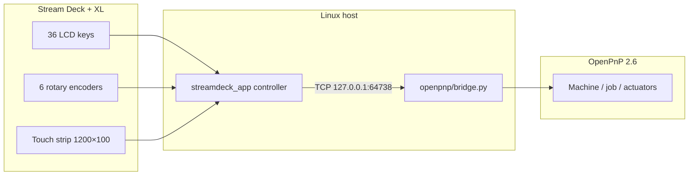

# Stream Deck OpenPnP Controller

A Linux controller for the **Elgato Stream Deck + XL** that drives **OpenPnP** on a **LumenPNP** pick-and-place machine. The deck becomes a dedicated machine control panel: jog axes, park, home, run jobs, toggle vacuums, and read live X/Y/Z/C status on the touch strip — without reaching for the mouse.

> **Hardware:** This project supports **only the Stream Deck + XL** (USB PID `0x00C6`). It does **not** support the Stream Deck +, original Stream Deck, Mini, Pedal, or other Elgato models.
>
> **Software:** Developed and tested against **OpenPnP 2.6** (the version bundled with LumenPNP). The bridge uses OpenPnP’s Jython scripting APIs (`submitUiMachineTask`, `fireTargetedUserAction`, etc.). Other OpenPnP 2.x versions may work but are not officially supported.

---

## Table of contents

- [Architecture](#architecture)
- [Capabilities](#capabilities)
- [Requirements](#requirements)
- [Installation (Ubuntu .deb)](#installation-ubuntu-deb)
- [Installation (from source)](#installation-from-source)
- [OpenPnP bridge setup](#openpnp-bridge-setup)
- [Running the controller](#running-the-controller)
- [Configuration](#configuration)
- [Command-line tools](#command-line-tools)
- [Logs and troubleshooting](#logs-and-troubleshooting)
- [Project layout](#project-layout)
- [Limitations](#limitations)

---

## Architecture

The system has two parts that communicate over a local TCP socket:



| Component | Role |
|-----------|------|
| **Controller** (`streamdeck_app`) | Python app on Linux. Reads HID input, renders key/touch images, sends commands to the bridge. |
| **Bridge** (`openpnp/bridge.py`) | Jython script loaded by OpenPnP at startup (`Startup.py`). Executes machine actions on the OpenPnP UI thread. |
| **Config** | Layered YAML files control lock timing, notifications, poll rates, and bridge endpoint. |

Only **one process** may open the Stream Deck HID device at a time. Stop the controller before running HID diagnostic tools such as `./log-events`.

---

## Capabilities

### Machine safety — lock / unlock

- Controls start **locked** by default. Press **UNLOCK** (key 8) to enable motion and job keys.
- **Unlock on press** when locked; **lock on release** when you started unlocked (tap-to-lock gesture).
- **Idle auto-lock** after configurable inactivity (`lock_idle_timeout_sec`). The UNLOCK key flashes as a warning before lock (`lock_idle_warning_sec`).
- **Bridge-offline lock:** if OpenPnP closes or the bridge stops, controls re-lock automatically.
- Blocked actions while locked show a desktop notification (if enabled).

### Button layout (36 keys, 9×4)

Keys are numbered `row * 9 + column` (row 0 = top).

```
Row 0:  [HOME] [Y+] [Z+] [N→Cam]              [LOCK]
Row 1:  [PWR]  [X-] [PkXY] [X+] [PkZ]         [JOB]
Row 2:       [Y-]    [Z-] [Cam→N]             [STEP]
Row 3:  [TOOL] [C+] [PkC]  [C-]          [VAC1][VAC2]
```

| Key / area | Action |
|------------|--------|
| **HOME** | Home machine (fires on **release** to avoid double-home) |
| **PWR** | Toggle machine enabled / connected |
| **LOCK** | Unlock (press) / lock (release) machine controls |
| **X±, Y±, Z±, C±** | Jog along axis using current jog step |
| **Pk XY / Z / C** | Park XY, safe Z, or nozzle rotation |
| **N→Cam / Cam→N** | Move tool to camera / camera to tool (OpenPnP target actions) |
| **TOOL** | Cycle nozzle / camera selection |
| **JOB** | Start / pause / resume job (icon reflects state) |
| **STEP** | Single-step the job |
| **VAC1 / VAC2** | Toggle head actuators (vacuum). Live reading shown when on. |

Keys grey out when the machine is off, unhomed, or the selected tool makes an action unavailable (matching OpenPnP’s `MachineControlsPanel` rules).

### Rotary encoders (6 dials)

| Dial | Default role |
|------|----------------|
| **0–3** (left group) | **Turn** to jog **X**, **Y**, **Z**, or **C**. **Press** to cycle that axis’s jog step distance (e.g. 10 → 1 → 0.1 mm for X/Y; separate step list for Z/C). |
| **4** (second from right) | **Turn** to adjust the OpenPnP **jog increment** slider (mm). **Press** to lock/unlock the dial (locked dials ignore turns). |
| **5** (rightmost) | **Turn** to adjust the OpenPnP **speed** slider (%). **Press** to lock/unlock the dial. |

Dials 4 and 5 start locked. After you press to unlock one, it auto-relocks after `dial_unlock_timeout_sec` unless you press again to re-lock it sooner.

### Touch strip status bar

The lower LCD shows a live **LumenPNP** status panel:

- **X / Y / Z / C** positions and jog step per axis
- Lock state, jog step, speed %, jog/speed dial lock indicators
- Selected tool, nozzle tip, machine status, job progress
- Bridge connection state (shows error styling when offline)

### Desktop notifications

Optional `notify-send` popups for lock/unlock, idle lock, bridge offline, blocked actions, and command errors. Toggle with `notifications_enabled` in config.

---

## Requirements

### Hardware

- **Elgato Stream Deck + XL** only (`0fd9:00c6`)
- Linux PC with USB access to the deck
- LumenPNP machine running **OpenPnP 2.6**

### Software (Ubuntu / Debian)

- Python 3.10+
- `libhidapi-libusb0`
- `python3-venv`, `python3-pip`
- OpenPnP with a configured machine (actuator names `VAC1` / `VAC2` expected for vacuum keys)
- Desktop: `libnotify-bin` (`notify-send`) for notifications — optional

---

## Installation (Ubuntu .deb)

### Build the package

```bash
./build-deb.sh
```

This produces `build/debian/streamdeck-openpnp_0.1.0_all.deb`.

### Install

```bash
sudo apt install ./build/debian/streamdeck-openpnp_0.1.0_all.deb
```

The package installs:

| Path | Contents |
|------|----------|
| `/usr/lib/streamdeck/` | Controller app, Python venv (created in `postinst`), OpenPnP bridge |
| `/etc/udev/rules.d/70-streamdeck.rules` | USB permissions for Elgato devices |
| `/etc/streamdeck/config.yaml` | System-wide default settings |
| `/usr/share/streamdeck/config.yaml.example` | Annotated template for user config |
| `/usr/lib/systemd/user/streamdeck.service` | Per-user systemd unit |
| `/usr/bin/streamdeck-run` | Start/restart controller manually |
| `/usr/bin/streamdeck-setup-user` | Per-user OpenPnP + config setup |
| `/usr/bin/openpnpctl` | CLI bridge client |
| `/usr/bin/streamdeck-test-bridge` | Quick bridge smoke test |

### Per-user setup (required once per login user)

```bash
streamdeck-setup-user
systemctl --user enable --now streamdeck
streamdeck-test-bridge
```

`streamdeck-setup-user`:

1. Symlinks the bridge into `~/.openpnp2/scripts/Events/Startup.py`
2. Creates `~/.config/streamdeck/config.yaml` from the example if missing

**Replug the Stream Deck** (or log out/in) after the first install so udev permissions apply.

---

## Installation (from source)

For development or machines without the `.deb`:

```bash
git clone <repo-url> streamdeck
cd streamdeck
./setup-once
```

`setup-once` installs apt dependencies, udev rules, a local Python venv, the OpenPnP bridge symlink, user config, and CLI links in `~/.local/bin`.

Then:

```bash
# Restart OpenPnP to load the bridge
streamdeck-test-bridge
./run          # or: streamdeck-run if linked
```

---

## OpenPnP bridge setup

The bridge **must** be installed as OpenPnP’s startup event script:

```
~/.openpnp2/scripts/Events/Startup.py  →  openpnp/bridge.py
```

- **Package install:** `streamdeck-setup-user` creates this symlink.
- **Source install:** `setup-once` creates it pointing at the repo.

**Restart OpenPnP** after any bridge code change. The controller can be restarted independently (`systemctl --user restart streamdeck` or `./run`).

When OpenPnP starts, the bridge writes its endpoint to:

```
~/.openpnp2/openpnp-bridge.json
```

Default: `127.0.0.1:64738`.

---

## Running the controller

### systemd (recommended after .deb install)

```bash
systemctl --user enable --now streamdeck   # start on login
systemctl --user restart streamdeck        # after config changes
systemctl --user status streamdeck
journalctl --user -u streamdeck -f
```

### Manual

```bash
streamdeck-run    # packaged
./run             # from source tree
```

The controller opens the deck, renders the full layout, starts the HID reader, and enters the main poll loop.

---

## Configuration

Settings are merged from several layers (later files override earlier ones):

1. Built-in defaults (`streamdeck_app/config.py`)
2. `/etc/streamdeck/config.yaml` (package install)
3. `config.yaml` in the source tree (development only)
4. **`~/.config/streamdeck/config.yaml`** — **your settings** (highest priority)

Copy the template to get started:

```bash
mkdir -p ~/.config/streamdeck
cp /usr/share/streamdeck/config.yaml.example ~/.config/streamdeck/config.yaml
# or from source:
cp packaging/config.yaml.example ~/.config/streamdeck/config.yaml
```

Restart the controller after editing.

### Common settings

| Key | Default | Description |
|-----|---------|-------------|
| `notifications_enabled` | `true` | Desktop popups via `notify-send` |
| `default_locked` | `true` | Start with controls locked |
| `lock_idle_timeout_sec` | `120` | Auto-lock after N seconds idle (`0` = disabled) |
| `lock_idle_warning_sec` | `10` | Flash UNLOCK key this many seconds before idle lock |
| `bridge_host` | `127.0.0.1` | OpenPnP bridge host (usually from `openpnp-bridge.json`) |
| `bridge_port` | `64738` | OpenPnP bridge TCP port |
| `brightness` | `60` | Deck LCD brightness (0–100) |
| `jog_step_mm` | `1.0` | Default jog distance (mm) |
| `poll_interval_ms` | `250` | OpenPnP status poll interval |
| `event_poll_interval_ms` | `16` | Main loop period (~60 Hz UI) |
| `deck_input_timeout_ms` | `50` | HID read timeout (Elgato recommends 50 ms) |
| `dial_unlock_timeout_sec` | `10` | Re-lock jog-increment / speed dials after temporary unlock |
| `dial_jog_coalesce_ms` | `30` | Merge rapid dial jog events |
| `vacuum_poll_interval_ms` | `1000` | Poll interval for active vacuum readings |

### Dial tuning

| Key | Description |
|-----|-------------|
| `dial_step_sizes_mm` | Z/C step sizes cycled by **pressing** dials 2–3 |
| `dial_xy_step_sizes_mm` | X/Y step sizes cycled by **pressing** dials 0–1 |
| `dial_default_step_mm` | Initial Z/C step when the controller starts |
| `dial_xy_default_step_mm` | Initial X/Y step when the controller starts |
| `jog_increment_dial_index` | Which dial adjusts jog increment (default `4`) |
| `speed_dial_index` | Which dial adjusts speed % (default `5`) |

### Environment override

```bash
STREAMDECK_CONFIG=/path/to/config.yaml streamdeck-run
```

---

## Command-line tools

### `openpnpctl`

Send commands directly to the bridge (OpenPnP must be running):

```bash
openpnpctl ping
openpnpctl position
openpnpctl home
openpnpctl park-xy
openpnpctl jog x 1
openpnpctl cycle-tool
openpnpctl toggle-actuator VAC1
openpnpctl read-actuator VAC1
```

### `streamdeck-test-bridge`

Runs `ping` and `position` — quick check that OpenPnP loaded the bridge.

### `log-events` (development / HID diagnostics)

Validates HID input against the Elgato spec. **Stop the controller first.**

```bash
pkill -f streamdeck_app.controller
./log-events
./log-events --no-display --strict
```

See [HID-NOTES.md](HID-NOTES.md) for protocol details.

---

## Logs and troubleshooting

| Log | Contents |
|-----|----------|
| `~/.openpnp2/log/streamdeck-controller.log` | App: key down/up, lock/unlock, commands |
| `~/.openpnp2/log/streamdeck-hid.log` | Raw HID reports and edges |
| `~/.openpnp2/log/streamdeck-bridge.log` | OpenPnP bridge commands and errors |
| `~/.openpnp2/openpnp-bridge.json` | Live bridge host/port |

### Common issues

| Symptom | Fix |
|---------|-----|
| `No Stream Deck found` | Replug deck; check `lsusb` shows `0fd9:00c6`; verify udev rule |
| `OpenPnP bridge not running` | Restart OpenPnP; confirm `Startup.py` symlink |
| First button press missed | Ensure only one HID client is running; use current controller (HID read/write decoupling fix) |
| Permission denied on `/dev/hidraw*` | Run `sudo udevadm control --reload-rules && sudo udevadm trigger`; replug |
| Notifications silent | Install `libnotify-bin`; check `notifications_enabled` |
| Bridge changes ignored | **Restart OpenPnP** (not just the controller) |
| Controller changes ignored | `systemctl --user restart streamdeck` or `./run` |

---

## Project layout

```
streamdeck/
├── streamdeck_app/          # Controller (HID, render, OpenPnP client)
│   ├── controller.py        # Main loop
│   ├── config.py            # Layered YAML config loader
│   ├── layout.py            # Key map and action definitions
│   └── devices/             # Stream Deck + XL HID driver
├── openpnp/
│   └── bridge.py            # Jython bridge → Startup.py
├── packaging/               # .deb templates and config example
├── build-deb.sh             # Build Ubuntu package
├── setup-once               # Source-tree one-time setup
├── run                      # Start controller from source
├── bin/openpnpctl           # CLI client
└── config.yaml              # Development overrides
```

---

## Limitations

- **Stream Deck + XL only** — PID `0x00C6`; no support for other Stream Deck models.
- **OpenPnP 2.6** — tested with the LumenPNP distribution. OpenPnP 1.x and 3.x are unsupported.
- **Linux only** — uses `hidapi` / `hidraw` and `notify-send`.
- **Single deck** — one Stream Deck per controller process.
- **Machine-specific actuators** — vacuum keys expect `VAC1` and `VAC2` in the OpenPnP configuration.
- **OpenPnP must be running** for machine actions; the deck still renders and locks safely when the bridge is offline.

---

## License

[MIT License](LICENSE) — Copyright (c) 2026 Trevor Flynn.

Stream Deck is a trademark of Elgato. OpenPnP is an open-source project. LumenPNP is an open-hardware pick-and-place machine.